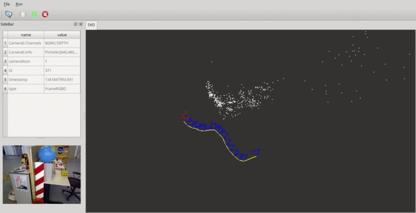

# GSLAM (A General SLAM Framework and BenchMark)

[](https://travis-ci.org/zdzhaoyong/GSLAM)
[](./LICENSE)
[](https://github.com/zdzhaoyong/GSLAM/releases)

## 1. Introduction

### 1.1. What is GSLAM?
GSLAM is aimed to provide a general open-source SLAM framework and benchmark with following features :

-> 1. Share the same API while maintain compatibility with different SLAM systems (such as feature based or direct methods).

-> 2. Support Monocular, Stereo, RGB-D or any custom input types (SAR, IMU, GPS and so on).

-> 3. Provide high efficient implementations of SLAM util classes like SO3, SE3, Camera, IMU, GPS, Bundle and so on.

-> 4. Support other features like coorperation SLAM to build a singular map.

-> 5. Provide benchmark tools for SLAM performance evaluation, make it easy to compare between SLAM systems.

### 1.2. What we can do with GSLAM?
1. *For SLAM developers* : Everyone can develop their own SLAM implementation based on GSLAM and publish it as a plugin with open-source or not. 
2. *For SLAM users* : Applications are able to use different SLAM plugins with the same API without recompilation and implementations are loaded at runtime.

## 2. Compilation and Install

### 2.1. Compile on linux (Tested in Ubuntu 14.04 and 16.04)

#### 2.1.1 Install dependency

**Qt** : REQUIRED, Used by the gslam GUI

```
sudo apt-get install libqt4-dev
```

**OpenCV** : Optional, Used by some dataset plugins and EstimatorOpenCV

```
sudo apt-get install libopencv-dev 
```


#### 2.1.2 Compile and insall GSLAM

```
mkdir build;cd build;
cmake ..;make;sudo make install
```

### 2.2 Compile on windows
Compile with CMake now is supported.

## 3. Start with GSLAM

## 3.1. Basic usages

Test modules with google test:

```
gslam Act=Tests --gtest_filter=*
```

Run a slam system with datasets:

```
gslam Dataset=(dataset file) SLAM=(the slam plugin)
```

## 3.2. Supported Datasets

GSLAM now implemented serveral plugins for public available datasets. It is very easy to play different datasets with parameter "Dataset" setted:

```
# Play kitti with monocular mode
gslam Dataset=<dataset_path>/odomentry/color/00/mono.kitti

# Play kitti with stereo mode
gslam Dataset=<dataset_path>/odomentry/color/00/stereo.kitti

# Play TUM RGBD Dataset (associate.txt file prepared)
gslam Dataset=<dataset_path>/rgbd_dataset_freiburg1_360/.tumrgbd

# Play TUM Monocular (images unziped)
gslam Dataset=<dataset_path>/calib_narrowGamma_scene1/.tummono

# Play EuRoC Dataset with IMU frames
gslam Dataset=<dataset_path>/EuRoC/MH_01_easy/mav0/.euroc

# Play NPU DroneMap Dataset
gslam Dataset=<dataset_path>/DroneMap/phantom3-village/phantom3-village-kfs/.npudronemap
gslam Dataset=<dataset_path>/DroneMap/phantom3-village/phantom3-village-unified/.npudronemap
```

The datasets are default to be played on realtime, and the play speed can be controled with "PlaySpeed":

```
gslam Dataset=<dataset_path>/odomentry/color/00/mono.kitti PlaySpeed=2.
```

The following dataset plugins are now implemented:

| Name    |    Channels        |   Description    |
| ------- |:------------------:|:-------------:|
| [KITTI](http://www.cvlibs.net/datasets/kitti/)   | Stereo,Pose        |               |
| [TUMMono](https://vision.in.tum.de/data/datasets/mono-dataset) | Monocular          | |
| [TUMRGBD](https://vision.in.tum.de/data/datasets/rgbd-dataset) | RGBD,Pose          ||
| [EuRoc](https://projects.asl.ethz.ch/datasets/doku.php?id=kmavvisualinertialdatasets)   | IMU,Stereo         ||
| [NPUDroneMap](http://zhaoyong.adv-ci.com/downloads/npu-dronemap-dataset/)| GPS,Monocular   ||
| CVMono | Monocular           | Online camera or video dataset using opencv.|

Users can also [implement dataset plugins by own](./doc/md/dataset.md).

### 3.3. Implemented SLAM plugins
| Name        |  ScreenShot  | Description  |
| ------- |:------:|:-------------:|
| [DSO](https://github.com/JakobEngel/dso)     |   | [code](https://github.com/pi-gslam/GSLAM-DSO) |
| [ORBSLAM](https://github.com/raulmur/ORB_SLAM) |  | [code](https://github.com/pi-gslam/GSLAM-ORBSLAM) |
| [SVO](https://github.com/uzh-rpg/rpg_svo) |  | [code](https://github.com/pi-gslam/GSLAM-SVO) |
| [TheiaSfM](http://www.theia-sfm.org/) |  | [code](https://github.com/zdzhaoyong/GSLAM-TheiaSfM) |

### 3.4. Configuration with Svar
More parameters can be setted with Svar at file *.cfg.
See more details of Svar at [PILBASE](https://github.com/zdzhaoyong/PIL2/blob/master/apps/SvarTest/README.md).

## 4. Contacts

YongZhao: zd5945@126.com

ShuhuiBu: bushuhui@nwpu.edu.cn

## 5. License

The GSLAM library is licensed under the BSD license. Note that this text refers only to the license for GSLAM itself, independent of its optional dependencies, which are separately licensed. Building GSLAM with these optional dependencies may affect the resulting GSLAM license.

```
Copyright (c) 2018 Northwestern Polytechnical University, Yong Zhao. All rights reserved.

This software was developed by the Yong Zhao at Northwestern Polytechnical University.

All advertising materials mentioning features or use of this software must display
the following acknowledgement: This product includes software developed by Northwestern Polytechnical University, PILAB.

Redistribution and use in source and binary forms, with or without modification,
are permitted provided that the following conditions are met:

1. Redistributions of source code must retain the above copyright notice, this list
of conditions and the following disclaimer.
2. Redistributions in binary form must reproduce the above copyright notice, this
list of conditions and the following disclaimer in the documentation and/or
other materials provided with the distribution.
3. All advertising materials mentioning features or use of this software must
display the following acknowledgement: This product includes software developed
by Northwestern Polytechnical University and its contributors.
4. Neither the name of the University nor the names of its contributors may be
used to endorse or promote products derived from this software without specific
prior written permission.

THIS SOFTWARE IS PROVIDED BY THE COPYRIGHT HOLDERS AND CONTRIBUTORS
"AS IS" AND ANY EXPRESS OR IMPLIED WARRANTIES, INCLUDING, BUT NOT
LIMITED TO, THE IMPLIED WARRANTIES OF MERCHANTABILITY AND FITNESS FOR
A PARTICULAR PURPOSE ARE DISCLAIMED. IN NO EVENT SHALL THE COPYRIGHT OWNER OR
CONTRIBUTORS BE LIABLE FOR ANY DIRECT, INDIRECT, INCIDENTAL, SPECIAL,
EXEMPLARY, OR CONSEQUENTIAL DAMAGES (INCLUDING, BUT NOT LIMITED TO,
PROCUREMENT OF SUBSTITUTE GOODS OR SERVICES; LOSS OF USE, DATA, OR
PROFITS; OR BUSINESS INTERRUPTION) HOWEVER CAUSED AND ON ANY THEORY OF
LIABILITY, WHETHER IN CONTRACT, STRICT LIABILITY, OR TORT (INCLUDING
NEGLIGENCE OR OTHERWISE) ARISING IN ANY WAY OUT OF THE USE OF THIS
SOFTWARE, EVEN IF ADVISED OF THE POSSIBILITY OF SUCH DAMAGE.
```

