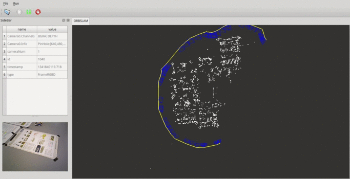

# GSLAM (A General SLAM Framework and BenchMark)

## 1. Introduction

### 1.1. What is GSLAM?
GSLAM is aimed to provide a general open-source SLAM framework and benchmark with following features :

-> 1. Share the same API while maintain compatibility with different SLAM systems (such as feature based or direct methods).

-> 2. Support Monocular, Stereo, RGB-D or any custom input types (SAR, IMU, GPS and so on).

-> 3. Provide high efficient implementations of SLAM util classes like SO3, SE3, Camera, IMU, GPS, Bundle and so on.

-> 4. Support other features like coorperation SLAM to build a singular map.

-> 5. Provide benchmark tools for SLAM performance evaluation, make it easy to compare between SLAM systems.

### 1.2. What we can do with GSLAM?
1. *For SLAM developers* : Everyone can develop their own SLAM implementation based on GSLAM and publish it as a plugin with open-source or not. 
2. *For SLAM users* : Applications are able to use different SLAM plugins with the same API without recompilation and implementations are loaded at runtime.

## 2. Compilation and Install

### 2.1. Compile on linux (Tested in Ubuntu 14.04 and 16.04)

#### 2.1.1 Install dependency

**OpenCV** : sudo apt-get install libopencv-dev 

**Qt** : sudo apt-get install build-essential g++ libqt4-core libqt4-dev libqt4-gui qt4-doc qt4-designer 

**OpenGL**: sudo apt-get install freeglut3 freeglut3-dev libglew-dev libglew1.10

#### 2.1.2 Compile and insall GSLAM

```
mkdir build;cd build;
cmake ..;make;sudo make install
```

### 2.2 Compile on windows
Compile with CMake now is supported.

## 3. Start with GSLAM

## 3.1. Basic usages

Test modules with google test:

```
gslam Act=Tests --gtest_filter=*
```

Run a slam system with datasets:

```
gslam Dataset=(dataset file) SLAM=(the slam plugin)
```

## 3.2. Supported Datasets

GSLAM now implemented serveral plugins for public available datasets. It is very easy to play different datasets with parameter "Dataset" setted:

```
# Play kitti with monocular mode
gslam Dataset=<dataset_path>/odomentry/color/00/mono.kitti

# Play kitti with stereo mode
gslam Dataset=<dataset_path>/odomentry/color/00/stereo.kitti

# Play TUM RGBD Dataset (associate.txt file prepared)
gslam Dataset=<dataset_path>/rgbd_dataset_freiburg1_360/.tumrgbd

# Play TUM Monocular (images unziped)
gslam Dataset=<dataset_path>/calib_narrowGamma_scene1/.tummono

# Play EuRoC Dataset with IMU frames
gslam Dataset=<dataset_path>/EuRoC/MH_01_easy/mav0/.euroc

# Play NPU DroneMap Dataset
gslam Dataset=<dataset_path>/DroneMap/phantom3-village/phantom3-village-kfs/.npudronemap
gslam Dataset=<dataset_path>/DroneMap/phantom3-village/phantom3-village-unified/.npudronemap
```

The datasets are default to be played on realtime, and the play speed can be controled with "PlaySpeed":

```
gslam Dataset=<dataset_path>/odomentry/color/00/mono.kitti PlaySpeed=2.
```

The following dataset plugins are now implemented:

| Name    |    Channels        |   Description    |
| ------- |:------------------:|:-------------:|
| [KITTI](http://www.cvlibs.net/datasets/kitti/)   | Stereo,Pose        |               |
| [TUMMono](https://vision.in.tum.de/data/datasets/mono-dataset) | Monocular          | |
| [TUMRGBD](https://vision.in.tum.de/data/datasets/rgbd-dataset) | RGBD,Pose          ||
| [EuRoc](https://projects.asl.ethz.ch/datasets/doku.php?id=kmavvisualinertialdatasets)   | IMU,Stereo         ||
| [NPUDroneMap](http://zhaoyong.adv-ci.com/downloads/npu-dronemap-dataset/)| GPS,Monocular   ||
| CVMono | Monocular           | Online camera or video dataset using opencv.|

Users can also [implement dataset plugins by own](./doc/md/dataset.md).

### 3.3. Implemented SLAM plugins
| Name        |  ScreenShot  | Description  |
| ------- |:------:|:-------------:|
| [DSO](https://github.com/JakobEngel/dso)     |   | [code](https://github.com/pi-gslam/GSLAM-DSO) |
| [ORBSLAM](https://github.com/raulmur/ORB_SLAM) |  | [code](https://github.com/pi-gslam/GSLAM-ORBSLAM) |

### 3.4. Configuration with Svar
More parameters can be setted with Svar at file *.cfg.
See more details of Svar at [PILBASE](https://github.com/zdzhaoyong/PIL2/blob/master/apps/SvarTest/README.md).

## 4. Contacts

YongZhao: zd5945@126.com

ShuhuiBu: bushuhui@nwpu.edu.cn

